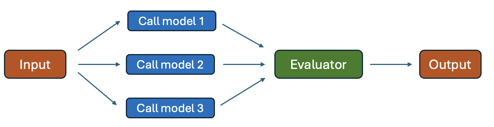
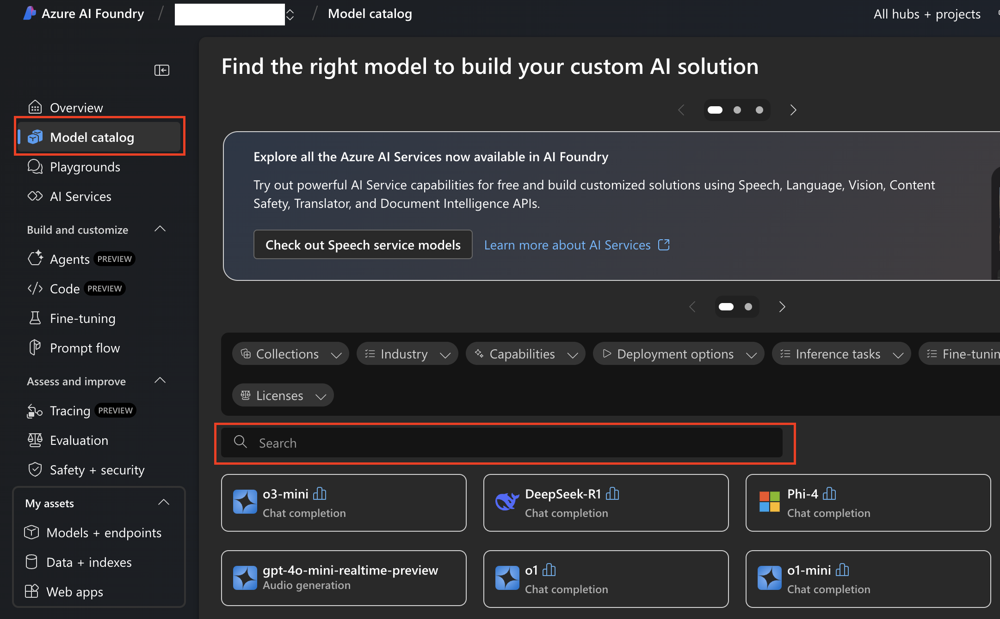
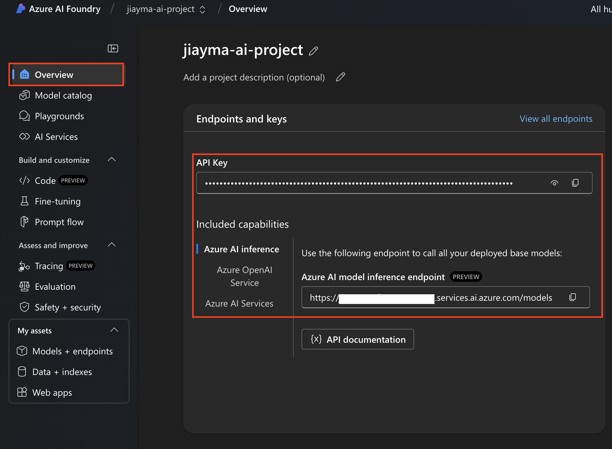
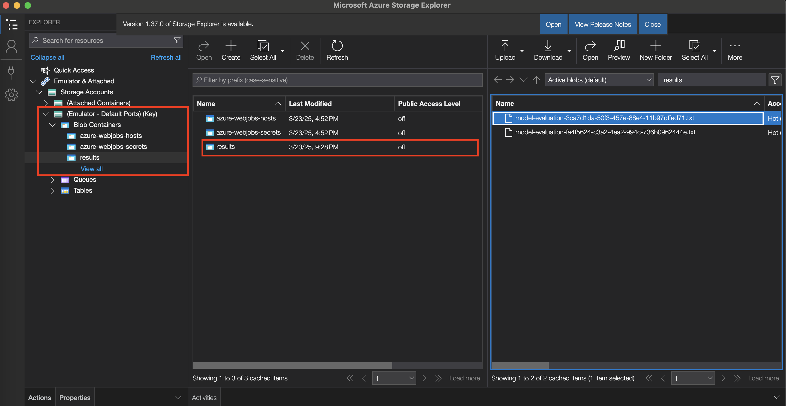

<!--
---
description: This Python sample shows how to use Durable Functions for model evaluation. 
page_type: sample
products:
- azure-functions
languages:
- python
- bicep
- azdeveloper
---
-->

# Model evaluation using Durable Functions (Python)

## About sample

This sample demonstrates how to use Durable Functions to call multiple models in parallel to quickly get the best response to a user's query. It uses three models - GPT-3.5-turbo, GPT-4o-mini, and Phi-4 - to answer a query. After getting the responses, it uses GPT-4o to evaluate and score the responses based on a certain criteria. 



There's no particular reason for choosing the models used in this sample - the key is to demonstrate how to leverage Durable Function's fan-out/fan-in pattern to easily realize this scenario. 

### About Durable Functions 

[Durable Functions](https://learn.microsoft.com/azure/azure-functions/durable/durable-functions-overview) is part of [Azure Functions](https://learn.microsoft.com/azure/azure-functions/functions-overview) offering. It helps  orchestrate stateful logic that is long-running and provides reliable execution. For example, when there's infrastructure failure (process crash, VM restart, etc.), the framework rebuilds application state and start from the point of failure instead of the beginning. This helps save time and money, especially for expensive operations like LLM calls. Common scenarios where Durable Functions is useful include agentic workflows, data processing, asynchronous APIs, batch processing, and infrastructure management.

Durable Functions needs a [backend provider](https://learn.microsoft.com/azure/azure-functions/durable/durable-functions-storage-providers) to persist application states. This sample uses the new [Durable Task Scheduler](https://learn.microsoft.com/azure/azure-functions/durable/durable-task-scheduler/durable-task-scheduler) backend that's currently in preview. 

> [!IMPORTANT]
> This sample creates several resources. Delete the resource group after testing to minimize charges.


## Run in your local environment

The project is designed to run on your local computer, provided you have met the  [required prerequisites](#prerequisites). You can run the project locally in these environments:

+ [Using Visual Studio Code](#using-visual-studio-code)
+ [Using Azure Functions Core Tools (CLI)](#using-azure-functions-core-tools-cli)

### Prerequisites

+ [Python 3.11](https://www.python.org/downloads/) 
+ [Azure Functions Core Tools](https://learn.microsoft.com/azure/azure-functions/functions-run-local?tabs=v4%2Cmacos%2Ccsharp%2Cportal%2Cbash#install-the-azure-functions-core-tools)
+ Install [Docker](https://www.docker.com/)
+ Install [Azurite storage emulator](https://learn.microsoft.com/azure/storage/common/storage-use-azurite). 
+ Install [Azure Storage Explorer](https://azure.microsoft.com/products/storage/storage-explorer#Download-4).
+ Clone the repo

### Deploy language models

1. [Create an Azure subscription with a valid payment method](https://azure.microsoft.com/pricing/purchase-options/pay-as-you-go). Free or trial Azure subscriptions *won't* work. 

1. [Create a project in Azure AI Foundry](https://learn.microsoft.com/azure/ai-studio/how-to/create-projects?tabs=ai-studio)

1. Go to **Model catalog** on the left menu and search for the following models to deploy:
    - GPT-4o
    - GPT-3.5-turbo
    - GPT-4o-mini
    - Phi-4 ([small language model by Microsoft](https://techcommunity.microsoft.com/blog/aiplatformblog/introducing-phi-4-microsoft%E2%80%99s-newest-small-language-model-specializing-in-comple/4357090) that has advanced reasoning capabilities in areas like math and science)

    
  

### Get endpoints and keys for models

You'll need the model API key and endpoint for the next step.

Go to the **Overview** tab of the project where models are deployed. API key is on the top.

To get the endpoint, click on **Azure AI inference** under "Included capabilities":

  

### Set up Durable Task Scheduler emulator 

1. Pull Docker image:
    ```bash
    docker pull mcr.microsoft.com/dts/dts-emulator:v0.0.5
    ```
1. Run Docker image:
    ```bash
    docker run -d -p 8080:8080 -p 8082:8082 mcr.microsoft.com/dts/dts-emulator:v0.0.5
    ```

  The emulator exposes several ports: 
  - `8080`: gRPC endpoint that allows the app to connect to the scheduler
  - `8082`: endpoint for monitoring dashboard  

### Run app using Visual Studio Code

1. Open **app** folder in a new terminal 
2. Open VS Code by entering `code .` in the terminal
3. In the root folder, create a file named `local.settings.json` with the following, filling in connection information from the previous step: 
    ```json
    {
      "IsEncrypted": false,
      "Values": {
          "AzureWebJobsStorage": "UseDevelopmentStorage=true",
          "BLOB_STORAGE_ENDPOINT": "DefaultEndpointsProtocol=http;AccountName=devstoreaccount1;AccountKey=Eby8vdM02xNOcqFlqUwJPLlmEtlCDXJ1OUzFT50uSRZ6IFsuFq2UVErCz4I6tq/K1SZFPTOtr/KBHBeksoGMGw==;BlobEndpoint=http://127.0.0.1:10000/devstoreaccount1;",
          "MODELS_ENDPOINT": "https://<resource name>.services.ai.azure.com/models",
          "AZURE_AI_API_KEY": "<api key>", 
          "DURABLE_TASK_SCHEDULER_CONNECTION_STRING": "Endpoint=http://localhost:8080;Authentication=None",
          "TASKHUB_NAME": "default",
          "FUNCTIONS_WORKER_RUNTIME": "python"
      }
    }
    ```

    > **Note:** 
    > The value shown for `BLOB_STORAGE_ENDPOINT` is the default value for Azurite (Azure Storage emulator) - it's not a private key.

4. Start Azurite by running:
    ```bash
    azurite start --skipApiVersionCheck
    ``` 

5. Run project with debugging (or press F5)

6. You can test easily by going to the `test.http` file and click "Send Request". This file has POST requests asking different questions. For example: 
  
    *"What is the value proposition of Azure Durable Functions and what is it used for?"*

    The request will return an HTTP response with some URLs that allow you to manage the orchestration, but this sample won't be using those.

7. The model evaluation result is stored in a container called *results* and can be viewed using the Azure Storage Explorer. Open the explorer, click **Emulator & Attached** > **Storage Accounts** > **(Emulator - Default Ports)(Key)** > **Blob Containers** > **results**. Double click on a `.txt` file to see evaluation result for a specific prompt. 

    

8. View the dashboard for orchestration details by going to **localhost://8082** and clicking on the "default" task hub. 

### Inspect the solution 

Take a look at the `orchestrator_function` to see how Durable Functions allows you to write code that runs in parallel. This function simply adds the activity functions that make calls to language models to a list and then call `context.task_all(tasks)`, which would signal the activity functions to run in parallel. Note that you don't have to worry about when each activity functions finishes or if any fail in the middle - Durable Functions handles the "fan in" and the automatic retries. Simply take the result and continue with your business logic.

```python
@app.orchestration_trigger(context_name="context")
def orchestrator_function(context):
  # Previous logic
  
  # Run all tasks in parallel
  tasks = [
    context.call_activity_with_retry("get_gpt35_result", retry_options, [user_prompt, system_prompt]),
    context.call_activity_with_retry("get_gpt4omini_result", retry_options, [user_prompt, system_prompt]),
    context.call_activity_with_retry("get_phi4_result", retry_options, [user_prompt, system_prompt])
  ]
  
 # Wait for all the parallel tasks to complete before continuing
  results = yield context.task_all(tasks)

  # Other business logic
```

Each of the `get_<model>_result` activity functions makes a call to the corresponding language model. For example, the `get_gpt35_result` looks like:

```python
@app.activity_trigger(input_name="prompts")
def get_gpt35_result(prompts: list):
    user_prompt, system_prompt = prompts[0], prompts[1]
    
    client = ChatCompletionsClient(
        endpoint=os.environ["MODEL_ENDPOINT"],
        credential=AzureKeyCredential(os.environ["MODEL_API_KEY"]),
    )
    response = client.complete(
        model="gpt-35-turbo", # model deployment name
        messages=[
            SystemMessage(content=system_prompt),
            UserMessage(content=user_prompt)
        ],
        temperature=0
    )
    
    return [response.choices[0].message.content, "gpt-35-turbo", datetime.now().strftime("%Y-%m-%d %H:%M:%S")]
```

### Run app using Azure Functions Core Tools (CLI)

1. Make sure Azurite is started before proceeding.

2. Open the cloned repo in a new terminal and navigate to the `app` directory: 
```bash
cd app
```

3. Create and activate the virtual environment:
```bash
python3 -m venv venv_name
```
```bash
source .venv/bin/activate
```
4. Install required packages:
```bash
python3 -m pip install -r requirements.txt
```

5. [Add `local.settings.json`](#using-visual-studio-code) to root directory (**app**)

6. Start function app 
```bash
func start
```

## Deploy and run app on Azure
1. Follow [instructions](https://learn.microsoft.com/azure/azure-functions/durable/durable-task-scheduler/quickstart-durable-task-scheduler) to create the required resources on Azure. One of the resources created is an Azure Storage account, which is used by the Function App for deployment purposes. The sample uses this same storage account to store the model evaluation results. 

1. On Azure portal, add these environment variables to the Function App by going to **Settings** > **Environment variables**: 
    - `MODELS_ENDPOINT`
    - `AZURE_AI_API_KEY`
    - `BLOB_STORAGE_ENDPOINT`   

    The value of `BLOB_STORAGE_ENDPOINT` should be the same as the `AzureWebJobsStorage` variable, which should be set automatically. 

1. Deploy the app.

1. Run the following command to get the endpoint of the HTTP trigger after deployment:
    ```azurecli
    az functionapp function list --resource-group <YOUR_RESOURCE_GROUP_NAME> --name <YOUR_FUNCTION_APP_NAME>  --query '[].{Function:name, URL:invokeUrlTemplate}' --output json
    ```

1. Update `test.http` with the right endpoint to send a POST request.

1. Go to the Azure Storage account used by the Function App and find **Data storage** > **Containers**. Click on the container named *results*. This container stores the results of evaluations.  

## Resources

For more information on Durable Functions, see the following:

* [Durable Functions overview](https://learn.microsoft.com/azure/azure-functions/durable/durable-functions-overview)
* [Durable Task Scheduler samples](https://github.com/Azure-Samples/Durable-Task-Scheduler/)
* Order processing workflow with Durable Functions [Python sample](https://github.com/Azure-Samples/durable-functions-order-processing-python), [C# sample](https://github.com/Azure-Samples/Durable-Functions-Order-Processing) 
